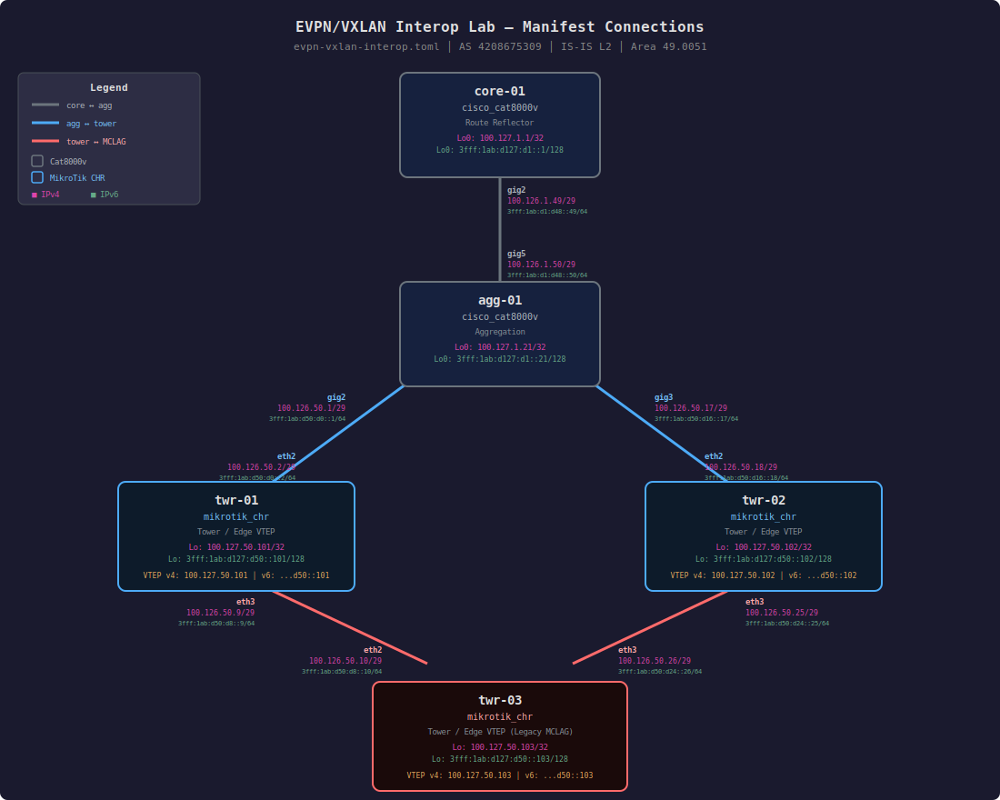

# EVPN/VXLAN Interop Lab — MikroTik + Cisco

Virtual network lab built with [Sherpa](https://docs.sherpalabs.net/), reproducing the
EVPN/VXLAN interop topology from
[stubarea51.net](https://stubarea51.net/2025/09/22/evpn-vxlan-interop-ipv4-ipv6-mikrotik-ip-infusion/).
The original lab tests EVPN/VXLAN between IP Infusion OcNOS and MikroTik RouterOS v7.
OcNOS nodes have been replaced with **Cisco Cat8000v** for use with the Sherpa lab platform.



## Topology

```
core-01 (Cat8000v, Route Reflector)
    │
  agg-01 (Cat8000v, Aggregation)
   / \
twr-01  twr-02   (MikroTik CHR, EVPN/VXLAN VTEPs)
   \   /
  twr-03          (MikroTik CHR, EVPN/VXLAN VTEP)
```

| Device | Platform | Software | Role |
|--------|----------|----------|------|
| core-01 | Cisco Cat8000v | IOS-XE 17.16.1a | BGP Route Reflector |
| agg-01 | Cisco Cat8000v | IOS-XE 17.16.1a | Aggregation |
| twr-01 | MikroTik CHR | RouterOS 7.20.8 | EVPN/VXLAN VTEP |
| twr-02 | MikroTik CHR | RouterOS 7.20.8 | EVPN/VXLAN VTEP |
| twr-03 | MikroTik CHR | RouterOS 7.20.8 | EVPN/VXLAN VTEP |

- **Underlay:** IS-IS Level-2, area 49.0051, dual-stack IPv4 + IPv6
- **Overlay:** BGP EVPN with VXLAN data plane — VNI 1104 (IPv4 transport), VNI 1106 (IPv6 transport)
- **BGP AS:** 4208675309, iBGP with core-01 as route reflector
- **Loopbacks:** 100.127.x.x/32, 3fff:1ab:d127::/48
- **P2P links:** 100.126.x.x/29, 3fff:1ab::/32

## Files and Folders

```
├── manifest.toml                        — Sherpa lab manifest (TOML)
├── evpn-vxlan-interop.md                — Device/interface/IP reference document
├── evpn-vxlan-interop.drawio            — draw.io topology diagram (editable)
├── evpn-vxlan-interop-connections.svg   — SVG topology diagram
│
├── evpn-vxlan-interop-testplan.md       — 199-test validation plan
├── evpn-vxlan-interop-testplan-results.md — Test results (190 PASS / 1 FAIL / 8 INFO)
├── evpn-vxlan-interop-failure-analysis.md — Root cause analysis for each failure
│
├── gather_and_test.py                   — Netmiko automation: collects configs and runs tests
├── ai-assist-summary.md                 — Summary of AI-assisted effort on this project
│
├── pyats_tests/                         — pyATS aetest validation suite
│   ├── job.py                           — easypy job file (runs all 10 test sections)
│   ├── test_01_physical.py              — Section 1: Physical / Link Layer
│   ├── test_02_addressing.py            — Section 2: IP Addressing
│   ├── test_03_isis.py                  — Section 3: IS-IS Underlay
│   ├── test_04_bgp.py                   — Section 4: BGP Control Plane
│   ├── test_05_evpn.py                  — Section 5: EVPN Control Plane
│   ├── test_06_vxlan.py                 — Section 6: VXLAN Data Plane
│   ├── test_07_overlay.py               — Section 7: Overlay Connectivity
│   ├── test_08_mac.py                   — Section 8: MAC Learning
│   ├── test_09_convergence.py           — Section 9: Convergence / Failover
│   ├── test_10_interop.py               — Section 10: Interop-Specific
│   ├── libs/
│   │   ├── connections.py               — Netmiko SSH connection manager
│   │   ├── parsers.py                   — Output parsing helpers
│   │   └── testdata.py                  — Expected values for all test cases
│   └── results/
│       └── TaskLog.job.html             — HTML test report
│
├── configs/                             — Device configurations
│   ├── core-01.cfg                      — IOS-XE config (translated from OcNOS)
│   ├── agg-01.cfg                       — IOS-XE config (translated from OcNOS)
│   ├── twr-01.rsc                       — MikroTik RouterOS v7 config
│   ├── twr-02.rsc                       — MikroTik RouterOS v7 config
│   ├── twr-03.rsc                       — MikroTik RouterOS v7 config
│   │
│   ├── running/                         — Running configs collected from live devices
│   │   ├── core-01.cfg
│   │   ├── agg-01.cfg
│   │   ├── twr-{01,02,03}.rsc
│   │   └── collected_at.txt             — Timestamp of collection
│   │
│   └── original-blog/                   — Verbatim configs from the stubarea51.net blog
│       ├── core-01-ocnos.cfg            — Original OcNOS config
│       ├── agg-01-ocnos.cfg             — Original OcNOS config
│       └── twr-{01,02,03}.rsc           — Original MikroTik configs
│
└── test-outputs/                        — Raw command outputs from automated test run
    ├── collected_at.txt                 — Timestamp of test run
    ├── 1.1_interface_state/             — Section 1: Physical / Link Layer
    ├── 1.2_mtu/
    ├── 2.1_ipv4_addressing/             — Section 2: IP Addressing
    ├── 2.2_ipv6_addressing/
    ├── 2.3_loopback/
    ├── 2.4_ipv4_link_pings/
    ├── 2.5_ipv6_link_pings/
    ├── 3.1_isis_neighbors/              — Section 3: IS-IS Underlay
    ├── 3.2_isis_instance/
    ├── 3.3_isis_ipv4_routes/
    ├── 3.4_isis_ipv6_routes/
    ├── 3.5_loopback_ipv4_pings/
    ├── 3.6_loopback_ipv6_pings/
    ├── 4.1_bgp_sessions/               — Section 4: BGP Control Plane
    ├── 4.2_bgp_afi/
    ├── 4.3_route_reflector/
    ├── 4.4_bgp_timers/
    ├── 5.1_evpn_type3/                  — Section 5: EVPN Control Plane
    ├── 5.2_evpn_reflection/
    ├── 5.3_evpn_rt/
    ├── 5.4_evpn_counts/
    ├── 6.1_vxlan_interfaces/            — Section 6: VXLAN Data Plane
    ├── 6.2_vtep_discovery/
    ├── 6.3_bridge_vlan/
    ├── 7.1_vni1104_pings/               — Section 7: Overlay Connectivity
    ├── 7.2_vni1106_pings/
    ├── 7.3_cross_vni/
    ├── 8.1_mac_learning/                — Section 8: MAC Learning
    ├── 9_skipped/                       — Section 9: Skipped (requires device shutdowns)
    ├── 10.1_route_reflector/            — Section 10: Interop-Specific
    ├── 10.2_dual_stack/
    └── 10.3_limitations/
```

## Test Results Summary

**190 PASS / 1 FAIL / 8 INFO** out of 199 tests.

The single remaining failure is **test 9.3.1** — MikroTik RouterOS does not remove stale
VTEP entries when EVPN Type 3 routes are withdrawn by BGP. This is a confirmed RouterOS
limitation, not a configuration issue. See
[evpn-vxlan-interop-failure-analysis.md](evpn-vxlan-interop-failure-analysis.md) for details.

## Running the pyATS Tests

Prerequisites: Python 3.9+, [uv](https://docs.astral.sh/uv/) (recommended), and SSH access to the lab devices.

```bash
# Create venv and install dependencies
uv venv .venv --python 3.9
uv pip install --python .venv/bin/python 'pyats[full]' netmiko 'setuptools<82'

# Run all test sections (skipping convergence/failover tests)
PATH="$PWD/.venv/bin:$PATH" .venv/bin/pyats run job pyats_tests/job.py --skip-convergence

# Run all test sections including convergence tests
PATH="$PWD/.venv/bin:$PATH" .venv/bin/pyats run job pyats_tests/job.py

# Generate HTML report
PATH="$PWD/.venv/bin:$PATH" .venv/bin/pyats run job pyats_tests/job.py \
    --skip-convergence --html-logs pyats_tests/results

# Run a single test section standalone
.venv/bin/python -m pyats.easypy pyats_tests/job.py --testscript pyats_tests/test_03_isis.py
```

The HTML report is saved to `pyats_tests/results/TaskLog.job.html`. pyATS also archives all runs in `~/.pyats/archive/`.

### Viewing Results with XPRESSO

pyATS includes a built-in web UI (XPRESSO) for browsing test results:

```bash
# View the most recent test run
.venv/bin/pyats logs view --latest --host 0.0.0.0 --port 9090

# List all archived runs
.venv/bin/pyats logs list
```
